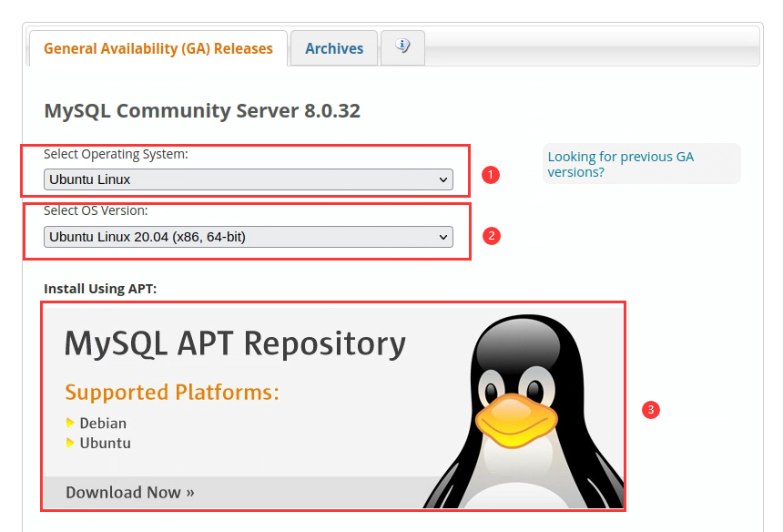
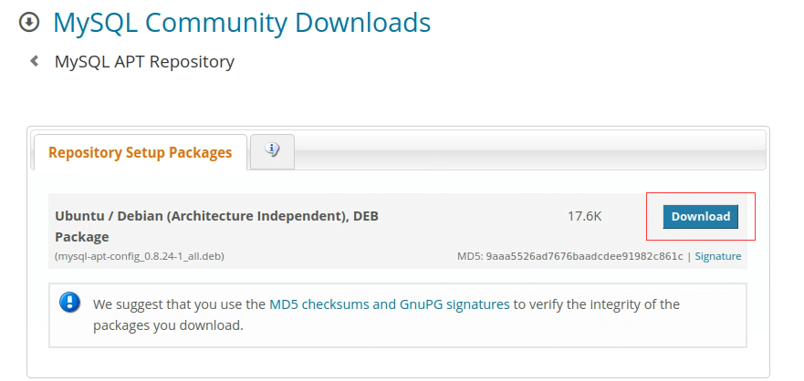

# 环境配置

# nginx
## 若以前安装过，先卸载
```
sudo apt-get --purge remove nginx
 
sudo apt-get --purge remove nginx-common
 
dpkg --get-selections|grep nginx
```

## 1.前置环境
```
sudo apt-get update
sudo apt-get install gcc
sudo apt-get install ruby
sudo apt-get install zlib1g
sudo apt-get install zlib1g.dev
sudo apt-get install libpcre3 libpcre3-dev
sudo apt-get install openssl libssl-dev
```
## 2.下载nginx源码
下载地址在https://nginx.org
源码在压缩包中附带1.22.1版本，nginx-1.22.1.tar.gz
解压到用户主目录 ~


注意：如果使用向日葵传输文件夹，文件夹的owner和gruop默认是root，对该文件夹的一切操作都需要root权限。或者也可以使用下面的方法：
```
sudo chown -R user <文件夹路径>
sudo chgrp -R user <文件夹路径>
```

## 3.下载nginx-http-flv-module
在压缩包中附带1.2.10版本nginx-http-flv-module-1.2.10.zip
把nginx-http-flv-module解压，移动到/usr/local目录下，并将文件夹改名为：nginx-http-flv-module
```
sudo mv nginx-http-flv-module-1.2.10 /usr/local/nginx-http-flv-module
```
进入nginx目录
```
cd ~/nginx-1.22.1
```
将nginx-http-flv-module添加到nginx中
```
sudo ./configure --prefix=/usr/local  --with-http_ssl_module --add-module=/usr/local/nginx-http-flv-module
```
生成make文件
```
sudo make
```
安装
```
sudo make install
```
测试是否安装成功
```
nginx -v
```

## 4.配置nginx
需要修改nginx的配置文件，它的位置在nginx-1.22.1/conf/nginx.conf
nginx.conf文件内容如下：
```

worker_processes  10; #should be 1 for Windows, for it doesn't support Unix domain socket
#worker_processes  auto; #from versions 1.3.8 and 1.2.5

#worker_cpu_affinity  0001 0010 0100 1000; #only available on FreeBSD and Linux
#worker_cpu_affinity  auto; #from version 1.9.10

error_log logs/error.log error;

#if the module is compiled as a dynamic module and features relevant
#to RTMP are needed, the command below MUST be specified and MUST be
#located before events directive, otherwise the module won't be loaded
#or will be loaded unsuccessfully when NGINX is started

#load_module modules/ngx_http_flv_live_module.so;

events {
    worker_connections  10240;
}

http {
    	include       mime.types;
    	default_type  application/octet-stream;
    	sendfile        on;
   	keepalive_timeout  65;
    	server {
        	listen       9000; #http-flv的拉流端口
        	server_name  localhost【这个地方写你的ip、或者说是域名都是可以的--】; #http-flv的拉流ip
        	location / {
            	root   html;
            	index  index.html index.htm;
       		}
            #http-flv的相关配置
        	location /live{
                flv_live on; #打开HTTP播放FLV直播流功能
                chunked_transfer_encoding  on;
                add_header 'Access-Control-Allow-Origin' '*';
                add_header 'Access-Control-Allow-Credentials' 'true';
        	}
        	location /hls{
                types {
                	application/vnd.apple.mpegurl m3u8;
			video/mp2t ts;
                 }
                 root ~/nginx-1.22.1/html/hls;
                 add_header 'Cache-Control' 'no-cache';
        	}
         	location /dash {
            	root ~/nginx-1.22.1/html/dash;
            	add_header 'Cache-Control' 'no-cache';
        	}
 
         	location /stat {
            	#configuration of push & pull status
              	rtmp_stat all;
              	rtmp_stat_stylesheet stat.xsl;
         	}
        	location /stat.xsl {
          		root ~/nginx-1.22.1/html;
        	}
 
         	location /control {
            	rtmp_control all; #configuration of control module of rtmp
			}
 
        	error_page   500 502 503 504  /50x.html;
        	location = /50x.html {
            	root   html;
        	}
    	}
 
}

rtmp_auto_push on;
rtmp_auto_push_reconnect 1s;
rtmp_socket_dir /tmp;


rtmp{
        out_queue 4096;
        out_cork 8;
        max_streams 128;
        timeout 15s;
        drop_idle_publisher 15s;
        log_interval 5s;
        log_size 1m;
        server{
            #推流端口
        	listen 1935;
            #推流应用名称
         	application myapp{
                 live on;
	 	 record off;
                 gop_cache on;
          	}
         	application hls{
          		live on;
          		hls on;
          		hls_path ~/nginx-1.22.1/html/hls;
          		hls_fragment 1s;
                        hls_playlist_length 3s;
        	}
         	application dash{
           		live on;
           		dash on;
           		dash_path ~/nginx-1.22.1/html/dash;
         	}
 
        }
}


```
文件中有五处路径为~/nginx-1.22.1，在实际使用时要换成具体的目录，例如用户为user，那么这里就要把~换成用户主目录/home/user
该文件要放到~/nginx-1.22.1/conf文件夹下
## 5.启动nginx
```
cd ~/nginx-1.22.1
sudo nginx -c conf/nginx.conf
sudo nginx -s reload
```
## 6.安装ffmpeg
```
sudo apt-get install ffmpeg
```
## 7.测试推流
```
ffmpeg -re -i rtsp://wowzaec2demo.streamlock.net/vod/mp4:BigBuckBunny_115k.mp4 -vcodec copy -acodec copy -f flv "rtmp://127.0.0.1:1935/myapp/test"
```


# Docker

## Docker安装
```
sudo apt-get install curl
curl -sSL https://get.daocloud.io/docker | sh
```

## 拉取镜像源
```
sudo docker pull iludfy/predict_model
```

## Docker创建容器并启动
拉取完镜像需要挂载到容器中才能启动，命令是docker run，它的参数如下：
```
sudo docker run [Options] image

#参数说明
--name="名字"           指定容器名字
-d                     后台方式运行
-it                    使用交互方式运行,进入容器查看内容
-p                     指定容器的端口
	-p ip:主机端口:容器端口  配置主机端口映射到容器端口
	-p 主机端口:容器端口（常用）
	-p 容器端口
-P                     随机指定端口
-e					   环境设置
-v					   容器数据卷挂载
```

规定端口为5000，输入下面的命令：
```
sudo docker run -p 5000:5000 iludfy/predict_model
```
一个容器就已经被创建好并启动了。
### 端口被占用解决办法：
以ubuntu系统为例：
先查到5000端口被哪个进程占用：
```
sudo netstat -ntlp
```
查到进程id后，使用kill命令杀死进程：
```
sudo kill {pid}
```
查看刚刚创建的容器的id：
```
sudo docker ps -a
```
启动
```
sudo docker start {id}
```


# MySQL 8.0

## 安装

先切换到root用户下：
```
sudo su
```

本文档中使用的操作系统是ubuntu20.04，默认使用apt下载mysql默认版本可能是mysql5，所以先去官网<https://dev.mysql.com/downloads/mysql/>下载mysql8的源：


我们将下载到的```mysql-apt-config_0.8.24-1_all.deb```文件放到用户主目录下，执行下面的命令：
```
dpkg -i mysql-apt-config_0.8.24-1_all.deb
```
会出现下面的界面，选择```mysql server -> mysql-8.0 -> ok```

之后我们使用下面的命令安装mysql：
```
apt-get upgrade
apt-get install mysql-server
```
安装过程中会让你设置初始密码：

若是没出错就已经安装好了，可以尝试登录一下：
```
mysql -u root -p
```
输入刚才的初始密码即可。


## 远程访问
防火墙这里先不提，需要提前配置好防火墙，开放端口。
mysql8默认只有本机可以访问，如果需要从其他机器远程访问数据库，需要进行配置。
登录数据库，查看权限表：
```
mysql -u root -p
mysql> use mysql;
mysql> select user,host from user where user='root';
```
会查询到如下结果：
```
+------+-----------------+
| user | host            |
+------+-----------------+
|root  | localhost       |
+------+-----------------+
1 row in set (0.00sec)
```
这里可以看到root用户的host字段是localhost，代表root用户只有本机可以访问。把它改成%即可远程访问：
```
update user set host = '%' where user ='root';
flush privileges;
```
然后mysql就允许远程主机访问了。


## 注意：
如果安装时未提示创建密码，则用sudo命令，用户root进入密码123456后，可以创建一个新用户，并用root用户赋予新建用户的权限。

### 远程连接不上

1. 修改端口

```sql
sudo vim /etc/mysql/mysql.cnf
```

/etc/mysql/下面有个mysql.cnf类似的文件。修改端口127.0.0.1为0.0.0.0


2.修改host
```sql
mysql> use mysql;

mysql> select user,host from user;

+------------------+-----------+
| user             | host      |
+------------------+-----------+
| root             | localhost|
| admin            | localhost |
| mysql.infoschema | localhost |
| mysql.session    | localhost |
| mysql.sys        | localhost |
+------------------+-----------+
 
mysql> update user set host ='%' where user ='root'

mysql> select user,host from user;

+------------------+-----------+
| user             | host      |
+------------------+-----------+
| root             | %         |
| admin            | localhost |
| mysql.infoschema | localhost |
| mysql.session    | localhost |
| mysql.sys        | localhost |
+------------------+-----------+
``` 

3. 修改加密方式
```sql
alter user 'root'@'%' identified with mysql_native_password by '你的密码';
//刷新权限
flush privileges;
```


# Java

## 下载jdk
先检验是否安装java:
```
java -version
```
若没有安装java，会得到如下输出：
```
user@user-NULL:~$ java -version

Command 'java' not found, but can be installed with:

sudo apt install openjdk-11-jre-headless  # version 11.0.18+10-0ubuntu1~20.04.1, or
sudo apt install default-jre              # version 2:1.11-72
sudo apt install openjdk-16-jre-headless  # version 16.0.1+9-1~20.04
sudo apt install openjdk-17-jre-headless  # version 17.0.6+10-0ubuntu1~20.04.1
sudo apt install openjdk-8-jre-headless   # version 8u362-ga-0ubuntu1~20.04.1
sudo apt install openjdk-13-jre-headless  # version 13.0.7+5-0ubuntu1~20.04

```
上面已经自动列出可选的版本了，我们这里选择java8安装：
```
sudo apt install openjdk-8-jre-headless
sudo apt install openjdk-8-jdk-headless
```
安装好后再检查java安装：
```
user@user-NULL:~$ java -version
openjdk version "1.8.0_362"
OpenJDK Runtime Environment (build 1.8.0_362-8u362-ga-0ubuntu1~20.04.1-b09)
OpenJDK 64-Bit Server VM (build 25.362-b09, mixed mode)

user@user-NULL:~$ javac -version
javac 1.8.0_362
```

## 配置java环境变量

要配置环境变量，首先需要知道java的安装路径：
```
sudo update-alternatives --config java
```
得到如下输出：
```
链接组 java (提供 /usr/bin/java)中只有一个候选项：/usr/lib/jvm/java-8-openjdk-amd64/jre/bin/java
无需配置。
```
拿到路径后打开环境变量配置文件：
```
sudo vim /etc/environment
```
在此文件的末尾，添加java路径：
```
JAVA_HOME="/usr/lib/jvm/java-8-openjdk-amd64/jre/bin/java"
```
修改此文件将为系统上的所有用户设置JAVA_HOME路径。

保存文件并退出编辑器。

现在重新加载此文件：
```
source /etc/environment
```
验证是否已设置环境变量：
```
echo $JAVA_HOME
```
输出路径：
```
/usr/lib/jvm/java-8-openjdk-amd64/jre/bin/java
```
其他用户需要执行命令source /etc/environment或注销并重新登录才能应用此设置。